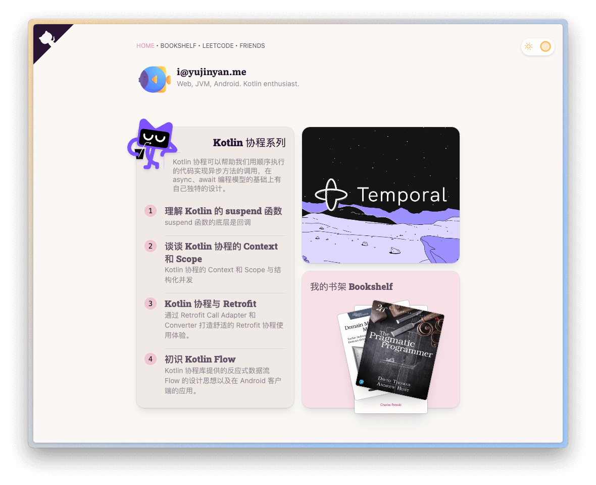

# [Jinyan's Blog](https://blog.yujinyan.me)



https://blog.yujinyan.me

## Astro

Built from
[Astro Starter Kit: Blog](https://github.com/withastro/astro/tree/main/examples/blog)

Technology:

- Astro
- Tailwind.css
- DaisyUI
- Solid.js
- MDX

## 🚀 Project Structure

```
├── public/
├── src/
│   ├── components/
│   ├── content/
│   ├── layouts/
│   └── pages/
├── astro.config.mjs
├── README.md
├── package.json
└── tsconfig.json
```

Astro looks for `.astro` or `.md` files in the `src/pages/` directory. Each page
is exposed as a route based on its file name.

There's nothing special about `src/components/`, but that's where we like to put
any Astro/React/Vue/Svelte/Preact components.

The `src/content/` directory contains "collections" of related Markdown and MDX
documents. Use `getCollection()` to retrieve posts from `src/content/blog/`, and
type-check your frontmatter using an optional schema. See
[Astro's Content Collections docs](https://docs.astro.build/en/guides/content-collections/)
to learn more.

Any static assets, like images, can be placed in the `public/` directory.

## 🧞 Commands

All commands are run from the root of the project, from a terminal:

| Command             | Action                                           |
| :------------------ | :----------------------------------------------- |
| `pnpm install`      | Installs dependencies                            |
| `pnpm dev`          | Starts local dev server at `localhost:4321`      |
| `pnpm build`        | Build your production site to `./dist/`          |
| `pnpm preview`      | Preview your build locally, before deploying     |
| `pnpm astro ...`    | Run CLI commands like `astro add`, `astro check` |
| `pnpm astro --help` | Get help using the Astro CLI                     |
