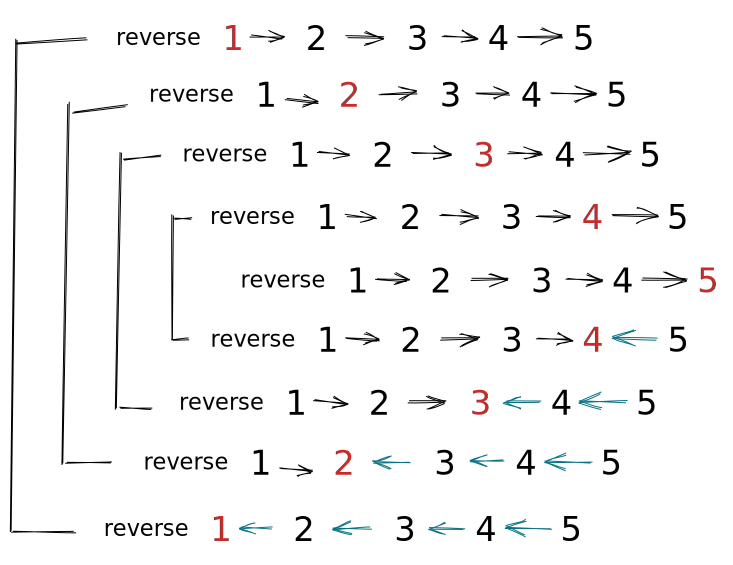

import LeetCode from "components/LeetCode"

<LeetCode.ProblemCard id={206} />

Given the head of a singly linked list, reverse the list, and return the reversed list.

```
Input: head = [1,2,3,4,5]
Output: [5,4,3,2,1]
```

## Recursive Method

```java
public ListNode reverse(ListNode head) {
  if (head == null || head.next == null) {
    return head;
  }
  ListNode newHead = reverse(head.next); // highlight-line
  head.next.next = head;
  head.next = null;
  return newHead;
}
```

[[fig | Recursive call trace.]]
| 
