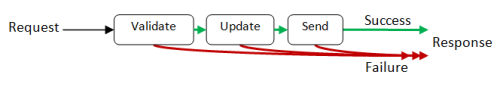

Domain Modeling Made Functional 一书介绍了如何用函数式编程去实现领域驱动设计，对两方面的内容都做了基础的介绍。本书的可读性非常强，尤其是在领域驱动设计这一部分。读 DDD 相关的书有的时候苦于讲解天花乱坠，或者内容陈旧不好理解。但这本书使用的例子非常接地气，行文诙谐畅快，阅读体验很棒。此外，从函数式的视角切入，有时候可以帮助我们更好地把握 DDD 的本质。可能读了这本书之后再去看一些传统的 DDD 著作会有新的理解。

本书以 F# 编程语言作为载体。F# 是 .net 平台上函数式风格的编程语言。作者对使用到的语言特性都有讲解。因此这本书作为函数式编程的入门读物似乎也非常不错。

## 领域驱动设计

> As a developer, you may think that your job is to write code. I disagree. A developer’s job is to solve a problem through software, and coding is just one aspect of software development. Good design and communication are just as important, if not more so.

我们谈领域驱动设计的意义在于看到太多「一竿子到底」的业务开发模式，拿到需求以后便「快、糙、猛」地对数据库做 CRUD，从 `controller` 开始，代码逻辑像一团弯弯曲曲的线球，从这个方法跳到另一个方法，缺乏内在联系。领域驱动设计告诉开发者应当尽可能充分利用编程语言的特性，使代码反映领域知识，并提供了相对应的一些架构思路。一定程度上，DDD 也是在回答如何提升代码维护性的问题。如果只需要程序能够跑起来，不需要维护，那么讨论就没有任何意义了。

### 领域（Domain）

开发者对领域有了清晰的认识以后，写出来的软件是对领域知识的理解和把握。这样写出来的代码还具备了知识的传承功能。

所谓「领域」就是业务。读 DDD 的书经常会看到作者描写开发者是如何与领域专家（Domain Experts）进行互动，学习领域知识，逐步加深自己对领域知识的了解。自己快成为半个领域专家之后才能写出靠谱的程序。在这个过程中，开发者应当调整心态，对领域心存敬畏之心，不该一下子陷入技术的细节难以自拔，更不能摆出一副技术为先，高高在上的姿态。

### 限界上下文（Bounded Context）

「上下文」指的是业务子领域（Subdomain），反映在代码里可能是一个包、模块或者微服务，实现「高内聚」；「限界」则强调模块之间的「低耦合」，是系统架构设计最重要的考虑。

想到前一阵看到的 SDUI（Server-Driven UI）思想，也可以用限界上下文来解读。将客户端放到软件架构里的视角来看，客户端本身也是一个限界上下文。比如同一个订单对象，在后端围绕订单有各种不同的上下文进行处理，但是在客户端往往只是一个简单的展示，并不是同一个东西。因此，我们在返回数据的时候需要加一层转换，通过 DTO（Data Transfer Object）在不同的上下文之间传递数据，降低客户端对业务逻辑的耦合。[Laravel 的 API Resource](https://laravel.com/docs/7.x/eloquent-resources) 起到了 DTO 的作用。

DDD 有个 Context Map 的概念，是一个分析模块（限界上下文）间依赖关系的工具，用于确定上下文间谁来确定消息格式。在上面服务端-客户端的例子中是所谓的 Consumer Driven Contract，即服务端为客户端上下文定制一套专门的数据结构。

在持久化（Persistence）这一章节，作者提出一个限界上下文应该「拥有」自己的数据存储及其结构，这样在持久层做出改动的时候不会波及其他上下文。因此限界上下文应该暴露对其数据进行访问的接口。比如在业务中常见的数据类需求，应当视作和具体业务模块分离的、单独拿出来的一个限界上下文。对应到持久层，数据模块的限界上下文应该从相关的业务上下文复制所需要的数据并单独进行维护。

## 函数式编程

每种编程语言都有函数。如何只用函数对纷繁复杂的领域知识进行建模？其中的关键问题是如何将一些简单的「零件」，比如一个简单函数，或者基本类型组合在一起。

### 类型系统

作者认为代码应当成为领域的一个「文档」。这对代码的可读性和表现力提出了相当高的要求。函数式编程语言强大的类型系统可以帮助我们更好地实现这一目标。

在 F# 中，可以通过 record 和 discriminated union 将 `bool` ，`int`，`string` 等基本类型组合在一起。

record 类似其他语言的 map、struct 这些数据结构：

```fsharp
type Payment = { 
	Amount: int;
	Method: PaymentMethod 
}

type CreditCardInfo = {
	CardType: CardType
	CardNumber: CardNumber
}
```

discriminated union 表示枚举出来的若干类型只出现一个，比如：

```fsharp
type PaymentMethod = 
	| Cash
	| Card of CreditCardInfo
```

其中的 `Cash` 和 `Card` 叫 tag，代表 `PaymentMethod` 的值是 `Cash` 类型**或者** `Card` 类型。tag 还可以附加额外的数据。比如 `Card` 可以附加 `CreditCardInfo` 类型的数据。

在面向对象的语言中，我们可以用继承实现类似的效果：

```kotlin
abstract class PaymentMethod
class Cash: PaymentMethod()
class Card(val info: CreditCardInfo): PaymentMethod()
```

将 record 和 discriminated union 合在一起看：

record 相当于若干键值对必须都出现，表达的是「与」的关系；discriminated union 相当于若干键值对只出现一个，表达的是「或」的关系。

一个类型可以视作值的集合。假设有键值对：

```
a: Type A, b: Type B, c: Type C
```

record 要求 a, b, c 存在，record 的值有 `size A * size B * size C` 种可能；union 则有 `size A + size B + size C` 种可能。因此 record 又被称作 product type，union 又被称作 sum type。record 和 sum type 被称作「代数数据类型」（Algebraic Data Type）

### 函数式地依赖注入

在面向对象设计的一个服务类中，我们可能会这样写：

```kotlin
@Service
class UserService(private val userRepository) {
	fun register(data: RegisterUserPayload): User {
		val user = toUserModel(data)
		return userRepository.save(user)
	}
	// ...
}
```

我们通过类的构造函数将依赖注入到类的内部状态中。而在函数式编程中，我们尽可能使用纯函数来表达业务逻辑。

在 `register` 函数中，`saveUser` 这个函数作为一个依赖，以函数入参的形式传了进来。只要保证函数的类型匹配就可以替换不同的实现。

```fsharp
let register
		saveUser           // dependency
		registerUserData =   // input
		registerUserData |> toUserModel |> saveUser
```

由于 F# 支持 partial application，我们可以将用于初始化函数的依赖和实际调用的输入值分开来，在不同的时候应用到函数上。这样函数的依赖可以被保存在闭包之中，达到了和面向对象保存内部状态类似的效果：

```fsharp
// initialize dependencies at the edges
let register = register saveUser

// call function with input
register createUserData
```

如果我们的 `UserService` 包含了大量和用户相关的操作，这些方法之间相关性可能并不高，所需的依赖可能也不尽相同。那么相比较而言，函数式风格一个函数对应一个业务逻辑 workflow 的做法粒度更细，依赖关系更加清晰。

### 纯函数与 effect

函数式编程提倡尽可能使用纯函数，但是我们的程序难以避免要与外部世界进行交互，比如做可能会失败的 IO 操作。因此函数式编程中有 effect 这个概念，用来表示除了单纯的输出之外，函数可能产生的作用。函数会产生的 effect 应当在函数的类型上体现出来，这样通过函数签名就可以对函数的性质有更加全面的了解。

比如对于可能产生异常的函数，应当谨慎抛出异常。抛出异常会中断代码执行的正常路径，产生意想不到的后果。一般比较边缘的函数（如 controller 层）可以考虑抛出异常，由统一的 handler 进行处理。对于比较核心或者底层的代码更加好的方式是用一个 `Result` union type 包裹函数的正常返回值以及可能产生的异常：

```fsharp
type Result<'Success, 'Failure> =
	| Ok of 'Success
	| Error of 'Failure

// example
type PayOrder =
	UnpaidOrder -> Payment -> Result<PaidOrder, PaymentError>
```

其中 `'Success` 和 `'Failure` 在 F# 中表示两个泛型。

在语义明确的情况下还可以使用可选值表示操作失败，可以当成是退化的 `Result` ：

```fsharp
type Optional<'a> =
	| Some of 'a
	| None
```

使用 union type 对异常进行建模，可以充分利用编译器的静态检查，强制我们在代码中对函数可能产生的异常进行适当的处理，提升代码的健壮性。

### 串联返回 `Result` 的函数

函数式编程喜欢将不同的函数「串联」在一起，形成一个数据流通、变换的管道。F# 有专门的「管道」（pipe）操作符 `|>` ：

```fsharp
let result = 100 |> funcA |> funcB |> funcC
```

这就要求一个函数的输出和下一个函数的输入的类型能够匹配的上。如果无法匹配的就需要用一些额外的辅助函数作「适配器」（adapter）。

在 `Result` 类的背景下，作者提出了「轨道」的比喻：一连串返回 `Result` 的函数输入和输出串联在一起，如果其中一个函数返回了错误类型，那么往后的函数直接全部走错误的「轨道」



这样的「适配器」有两种：`bind` (或者叫 `flatMap`) 以及 `map` ，由此推出了 monad 的概念。`Result` 就是一个 monad，其他常见的比如 JDK 8 加入的 `Optional` 。本书还提到了 Reader Monad 做依赖注入。不过本书作为入门书籍，并未做深入介绍。

本书的作者 Scott Wlaschin 有一个 [https://fsharpforfunandprofit.com/](https://fsharpforfunandprofit.com/) 网站，对 F# 和函数式编程有更加详细的介绍。

参考链接

- [Scala: What do "effect" and "effectful" mean in functional programming?](https://alvinalexander.com/scala/what-effects-effectful-mean-in-functional-programming/)