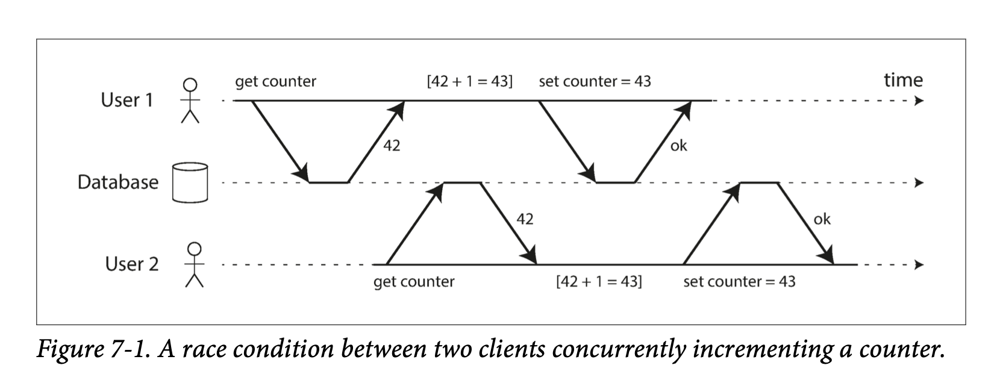

[[tip|🚧]]
| 尚未完成 - Work In Progress

## 关于 Java 语言

The Java language is …

- Compiled: 需要用 javac 将 .java 源代码文件编译成 .class 字节码文件
- Object-oriented: 面向对象

### Hello World

```java
// HelloWorld.java
class HelloWorld {
    public static void main(String[] args) {
        System.out.println("Hello World!");
    }
}
```

```shell
$ javac HelloWorld.java
$ java HelloWorld
```

### 面向对象 Object-oriented

Java:
```java
@Value
public class Person implements A {
    String name;

    String introduce() {
        return "I'm " + name;
    }

    // Run this programmin with `java Person`
    public static void main(String[] args) {
        A harry = new Person("Harry");
        String a = "abc";

        System.out.println(harry.introduce());
    }
}

interface A {
  String introduce();
}
```

TypeScript:
```tsx
type Person = {
  name: string
}

const harry = {
  name: "Harry"
}

function introduce(person: Person) {
  return `I'm ${person.name}`
}

console.log(harry)
```


### Duck typing vs. Nominative typing

[[tip | 🔑]]
| Java 和 TypeScript 类型系统的区别

**Nominative typing**: an object is of a given type *if it is declared to be* (or if a type's association with the object is inferred through mechanisms such as object inheritance).

**Duck typing**: an object is of a given type if it has all methods and properties required by that type.

## Java 虚拟机

### The runtime environment

JVM is the **runtime** for Java. (JVM → Java, Node.js → JavaScript).

Android’s Dalvik and its replacement Android Runtime (ART) are other widely used Java runtimes.

[[tip | 🔑]]
| Difference between `java HelloWorld` and `node hello.js`

interpreting vs. compiling

- V8 compiles JavaScript source code to native machine code [at runtime](https://en.wikipedia.org/wiki/Just-in-time_compilation). As of 2016, it also includes Ignition, a [bytecode interpreter](https://en.wikipedia.org/wiki/Bytecode_interpreter). [(Wikipedia - Node.js)](https://en.wikipedia.org/wiki/Node.js)
- JVM interprets bytecode produced by javac. It also uses JIT (just-in-time compilation) to translate part of Java bytecode into native machine code.

### Other major JVM languages

- Kotlin：改良版 Java、Android 开发首选语言
  - NPE
  - static by default
  - fix mutable by default

  ```kotlin
  val foo: String = ""
  var bar: Int = 1
  fun sayHi(): String = TODO()
    ```

  ```ts
  const foo = ""
  let bar: number = 1
  function sayHi() {
   // ...
  }
    ```

- Groovy：弱类型、动态、Gradle
- Scala：学院派、函数式、大数据、Flink
- Clojure：动态、函数式、Lisp

## Spring Boot

### 快速上手

在 [Spring Initializr](https://start.spring.io/) 创建一个项目脚手架，导入 IDE 即可

### JSON 序列化、反序列化

[[tip| 🔑]]
| 前端传给后端的 JSON 字符串是如何变成对象的？

JavaScript:
```js
const c = JSON.stringify({id: 1, title: "hi"})
JSON.parse(c)
```

类比 Java：
```java
@Value
class Campaign {
  int id;
  String title;
}

ObjectMapper objectMapper = new ObjectMapper();

Campaign campaign = new Campaign(1, "hi");
String json = objectMapper.writeValueToString(campaign); // highlight-line
Campaign c = objectMapper.readValueFromString(json, Campaign.class); // highlight-line
```

[[tip | 🔍]]
| 反序列化的时候需要指定得到对象的类型

有多种 JSON 序列化/反序列化的库，如 Jackson、Gson 等。Java 后端项目推荐用 Jackson（也是 Spring Boot 默认的 JSON 库）。

常见数据类型对应关系：

|     | Java 类型                   | JS 类型                      |
|-----|---------------------------|----------------------------|
| 日期  | `java.time.ZonedDateTime` | 原生 Date、moment.js、day.js * |
| 枚举  | enum                      | string                     |


`LocalDateTime` vs `ZonedDateTime`
- `ZonedDateTime` 带有时区
- `LocalDateTime` 不带时区

```shell
$ node
Welcome to Node.js v16.17.0.
Type ".help" for more information.
> new Date()
2022-09-13T02:10:14.100Z
```

JS 的 `Date` 带时区，所以直接对应 Java 的 `ZonedDateTime`

## 注解 Annotation

添加元信息（Metadata）


| 用途    | 主要场景         | 例                        |
|-------|--------------|--------------------------|
| 编译器提示 | 给编译器额外信息     | `@Override`              |
| 编译时处理 | 代码生成         | Lombok                   |
| 运行时处理 | 路由配置、Bean 校验 | JSR-303: Bean Validation |

### 编译器提示

```java
public class OverrideDemo {

    static class Shape {
        String name() {
            return "Shape";
        }
    }

    @Override // highlight-line
    static class Circle extends Shape {
        String name() {
            return "Circle";
        }
    }
}
```

### 编译时处理

[Project Lombok](https://projectlombok.org/features/)

我用得最多的：`@Value`，用于 immutable data class

JDK 17 的话可以直接用 record

### 运行时处理

```java
import lombok.Value;
import org.hibernate.validator.HibernateValidatorFactory;

import javax.validation.ConstraintViolation;
import javax.validation.Validation;
import javax.validation.Validator;
import javax.validation.ValidatorFactory;
import javax.validation.constraints.Min;
import java.util.Set;

/**
 * https://hibernate.org/validator/documentation/getting-started/
 */
public class BeanValidationDemo {

    @Value
    static class Article {
        @Min(5)
        String title;
    }

    public static void main(String[] args) {
        ValidatorFactory factory = Validation.buildDefaultValidatorFactory();
        Validator validator = factory.getValidator();
        Set<ConstraintViolation<Article>> violations = validator.validate(new Article("Hi"));
        System.out.println(violations);
    }
}
```

```java
import lombok.Value;
import lombok.extern.slf4j.Slf4j;

import java.lang.annotation.Retention;
import java.lang.annotation.RetentionPolicy;
import java.lang.reflect.Field;

@Slf4j
public class RuntimeDemo {
    @Retention(RetentionPolicy.RUNTIME)
    @interface Range {
        int min();
        int max();
    }

    @Value
    static class Article {
        @Range(min = 1, max = 100)
        String title;
    }

    public static void main(String[] args) {
        Article article = new Article("Hello World");
        Field[] fields = article.getClass().getDeclaredFields();
        for (Field field : fields) {
            Range range = field.getAnnotation(Range.class); // highlight-line
            if (range != null) {
                log.info("range: min is {}, max is {}, field {}", range.min(), range.max(), field);
            }
        }
    }
}
```

## 并发编程

### 线程 API

```java
public class ThreadDemo {
    @SneakyThrows
    public static void main(String[] args) {
        Thread thread = new Thread(() -> {
            try {
                Thread.sleep(1000L);
                System.out.printf("Inside %s%n", Thread.currentThread().getName());
            } catch (InterruptedException e) {
                throw new RuntimeException(e);
            }
        });
        thread.start();
        thread.join();
    }
}
```

### 线程池

```java
public class ThreadPoolDemo {

    private static final ExecutorService POOL = Executors.newCachedThreadPool();

    @SneakyThrows
    static String writeFile() {
        Thread.sleep(1000);
        return "file.csv";
    }

    @SneakyThrows
    public static void main(String[] args) {
        Future<String> filename = POOL.submit(ThreadPoolDemo::writeFile);
        System.out.println(filename.get());
    }
}
```

### Request Per Thread

传统 Spring MVC 使用的是一个 http 请求对应一个线程的模型

```java
@RestController
class NaiveCounterDemoController {
    // 线程不安全的示范
    private int counter = 0;

    @PostMapping("/inc")
    public void inc() {
        counter++;
    }

    @GetMapping("/get")
    public int get() {
        return counter;
    }
}
```

### Shared Mutable State

[[fig | 并发加计数器的问题]]
| 

解决方法：
- Thread-safe data structures: `AtomicInteger` （counter 场景首选）
- Mutual exclusion
- Thread confinement

[Shared Mutable State and Concurrency in Kotlin](https://kotlinlang.org/docs/shared-mutable-state-and-concurrency.html)

## 数据库持久化

- Raw SQL / Template Engine: MyBatis XML
- SQL DSL: JOOQ

```java
SELECT AUTHOR.FIRST_NAME, AUTHOR.LAST_NAME, COUNT(*)
FROM AUTHOR
JOIN BOOK ON AUTHOR.ID = BOOK.AUTHOR_ID
WHERE BOOK.LANGUAGE = 'DE'
AND BOOK.PUBLISHED > DATE '2008-01-01'
GROUP BY AUTHOR.FIRST_NAME, AUTHOR.LAST_NAME
HAVING COUNT(*) > 5
ORDER BY AUTHOR.LAST_NAME ASC NULLS FIRST
LIMIT 2
OFFSET 1
```

```java
create.select(AUTHOR.FIRST_NAME, AUTHOR.LAST_NAME, count())
      .from(AUTHOR)
      .join(BOOK).on(AUTHOR.ID.equal(BOOK.AUTHOR_ID))
      .where(BOOK.LANGUAGE.eq("DE"))
      .and(BOOK.PUBLISHED.gt(date("2008-01-01")))
      .groupBy(AUTHOR.FIRST_NAME, AUTHOR.LAST_NAME)
      .having(count().gt(5))
      .orderBy(AUTHOR.LAST_NAME.asc().nullsFirst())
      .limit(2)
      .offset(1)
```

- ORM: Hibernate / prisma.io
