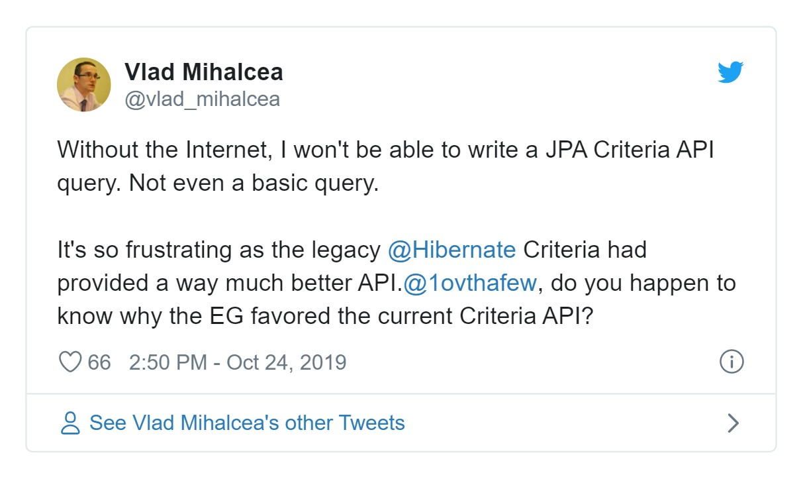
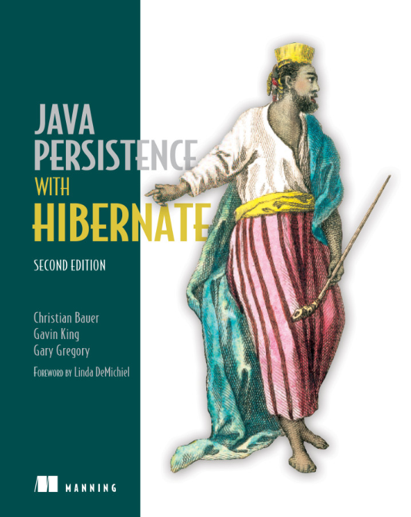

本文是在团队做的关于 [JOOQ](https://www.jooq.org/) 的 Presentation 文字版。回顾了团队在 ORM 方面的实践，介绍了 JOOQ 的优势，以及在项目中参考 Repository 模式的应用探索。

## Seminar ↬ Presentation

- Presentations, _exposé_
- The Feynman Technique
- http://www.yinwang.org/blog-cn/2020/03/03/cs-course

  > 苏格拉底承认他自己本来没有知识，而他又要教授别人知识。这个矛盾，他是这样解决的：这些知识并不是由他灌输给人的，而是人们原来已经具有的；人们已在心上怀了“胎”，不过自己还不知道，苏格拉底像一个“助产婆”，帮助别人产生知识。

## Mental Framework ...

- 🎉 Problem Solving (How did we solve daily challenges at work?)
- 💡  Idea ↬ Implementation (What are the big ideas behind specific technology?)

[Drawing a map of distributed data systems - Martin Kleppmann](https://martin.kleppmann.com/2017/03/15/map-distributed-data-systems.html)

> Most computing books describe one particular piece of software and discuss all the aspects of how it works. This book is structured differently: **it starts with the concepts**—discussing the high-level approaches of how you might solve some problem, and **comparing the pros and cons of each**—and then points out **which pieces of software use which approach**. The maps use the same structure: the region in which a city is located tells you what approach it uses.

## Status Quo: Laravel

```php
// 🤔 complex object tree, easy N+1
$order->item->product->city

// 🤔 string identifier
Article::query()->whereHas('banners', function($query) use ($bannerId) {
	$query->where('id', $bannerId);
});

// 🤔 attributes too dynamic
$users = User::select([
    'users.*',
    'last_posted_at' => Post::selectRaw('MAX(created_at)')
            ->whereColumn('user_id', 'users.id')
])->withCasts([
    'last_posted_at' => 'datetime'
])->get();
```

## Spring Data JPA (Hibernate)

```kotlin
@Entity
@Table(name = "articles")
class Article(
        @Id @GeneratedValue(strategy = GenerationType.IDENTITY)
        var id: Int? = null,
        var title: String,
        var body: String,
        var status: Int,

        @Column(name = "city_id", insertable = false, updatable = false)
        var cityId: Int,

        @BatchSize(size = 15)
        @OneToMany(mappedBy = "owner", fetch = FetchType.LAZY)
        var assets: MutableList<SubjectAsset> = mutableListOf()

        // ...
)
```

```kotlin
interface ArticleRepository : BaseJpaRepository<Article, Int> {
    fun findAllByAliasIn(aliases: List<String>): List<Article>

    @EntityGraph(attributePaths = ["user", "categories"])
    override fun findById(id: Int): Optional<Article>

    @EntityGraph(attributePaths = ["user"])
    override fun findAll(spec: Specification<Article>?, pageable: Pageable): Page<Article>

    @EntityGraph(attributePaths = ["user"])
    @Query("select o from Article o where o.deletedAt is null and o.featuredAt is not null order by o.id desc")
    fun findLatestFeaturedWithUserPaged( pageable: Pageable): Page<Article>

    @EntityGraph(attributePaths = ["user"])
    fun findByUserId(id: Int, pageable: Pageable): Slice<Article>

    @EntityGraph(attributePaths = ["user", "city"])
    @Load(attributePaths = ["categories", "assets", "comments", "bookmarks"])
    fun findAllByOrderByIdDesc(pageable: Pageable): Page<Article>

    //...
}
```

## What's wrong 🤔 ?

### Object-Relational Impedance Mismatch

[ORM Lazy Loading Pitfalls - Lev Gorodinsk](http://gorodinski.com/blog/2012/06/16/orm-lazy-loading-pitfalls/)

> In practice, the mismatch exists because **SQL is best suited for ad hoc queries and ad hoc field selection** whereas **OOP is best suited for static models**. From the relational perspective there is a tension to **select data specifically for a given query** which is in turn designed for a specific use case. From the OOP perspective there is a tension to **conform the query to an object model** which is designed for a variety of use cases.

- Object: static models, conform quries to an object model
- Relational (SQL): ad-hoc queries / ad-hoc field selection, designed specifically for a use case

### How to do ad-hoc query in JPA ?

- use native sql 😞 not dynamic
- use criteria api 😵 very difficult to write



https://twitter.com/vlad_mihalcea/status/1187260017797423104


```kotlin
val withUser = Specification<Order> { root, query, _ ->
    if (query.resultType != java.lang.Long::class.java) {
        root.fetch<Order, User>(Order::user.name)
    }
    return@Specification null
}

val withReservation = Specification<Order> { root, query, _ ->
    if (query.resultType != java.lang.Long::class.java) {
        root.fetch<Order, List<Reservation>>(Order::reservations.name)
    }
    return@Specification null
}

fun containsKeyword(keyword: String): Specification<Article> {
    return Specification() { s, criteria, builder ->
        criteria.orderBy(builder.desc(s.get<String>("id")))
        builder.or(
                builder.like(s.get("title"), "%$keyword%"),
                builder.like(s.get("body"), "%$keyword%")
        )
    }
}
```

### Class design coupled to db schema 

🤔

### Too much magic ✨

first-level cache, second-level cache, detached objects, lazy / earger fetching, collection mapping ...

[How Hibernate Ruined My Career](https://www.toptal.com/java/how-hibernate-ruined-my-career)



https://www.zhihu.com/question/22098131/answer/267025235

为什么阿里巴巴的持久层采用 iBatis 框架,而不使用 hibernate 框架呢？感觉 hibernate 更厉害的样子？

> 还有一点可能是我个人喜好了，作为一个后端程序员，我比较喜欢**每一行代码我都精确知道它到底在干什么**。**尤其是数据库访问的代码，往往系统的瓶颈就在这些地方产生，每一行都不能小看**。我看过 hibernate 早期版本的部分代码，比我想象的复杂和强大很多。的确很多地方 hibernate 可以强大的只用一行代码解决很多问题，但比如说一个 `update()` 或者`save()` 到底做了什么，这里既有 hibernate 本身的逻辑，也有你应用的逻辑，如果这一行产生了问题，你该如何去做？我个人觉得这是很难搞的，还不如一开始费点事，用 ibatis 这种。（北南）

## How to eliminate string identifiers ?

- Laravel: migration → model (weak attributes repr.)
- Hibernate: pojo → schema → db (duplicate work)

Use **codegen** to generate the local representation of the internal or external truth.

[Truth First, or Why You Should Mostly Implement Database First Designs - Lukas Eder](https://blog.jooq.org/2018/06/06/truth-first-or-why-you-should-mostly-implement-database-first-designs/)

> But essentially, the point of generated code is that it provides a Java representation of something that we take for granted (a “truth”) either within or outside of our system.

```
./gradlew jib

> Task :compileKotlin FAILED
e: /some/path/OrderRepository.kt: (37, 17):
* Unresolved reference: CITY_ID

e: /some/path/OrderController.kt: (106, 39):
* Unresolved reference: CITY_ID

e: /some/path/ProductItem.kt: (41, 23): Unresolved reference: assets

FAILURE: Build failed with an exception.

What went wrong:
Execution failed for task ':compileKotlin'.
> Compilation error. See log for more details

Try:
Run with --stacktrace option to get the stack trace. Run with --info or --debug option to get more log output. Run with --scan to get full insights.

Get more help at https://help.gradle.org

BUILD FAILED in 14s
1 actionable task: 1 executed
```

### pojo decoupled from db schema

[Do-It-Yourself ORM as an Alternative to Hibernate - Philipp Hauer](https://phauer.com/2017/do-it-yourself-orm-alternative-hibernate-drawbacks/)

```kotlin
import com.jojotoo.db.Tables.*
import org.jooq.Record

fun UserTable.toUser(record: Record) = User(
        id = record[ID].toInt(),
        userNickname = record[USER_NICKNAME],
        role = record[USER_ROLE].toInt(),
        tel = record[USER_TEL],
        mark = record[USER_MARK].toInt(),
        _userAvt = record[USER_AVT]
)
```

- no magic at all
- easy custom type conversions (enums, etc.)

## JOOQ - Full SQL Power with Strong Type

### JOOQ has unsigned types

```kotlin
import com.jojotoo.db.Tables.*
import org.jooq.DSLContext

@Repository
class FollowRepositoryImpl(private val context: DSLContext) : FollowRepository {

    override fun findMutualFollow(userId: Int, followIds: List<Int>): List<Follow> {
        return with(USER_FOLLOWS) {
            val q1 = context.select().from(this).where(
                USER_ID.eq(UInteger.valueOf(userId)) // highlight-line
                        .and(FOLLOW_ID.`in`(followIds))
            )
            val q2 = context.select().from(this).where(
                FOLLOW_ID.eq(UInteger.valueOf(userId))
                        .and(USER_ID.`in`(followIds)) // highlight-line
            )
            q1.union(q2).fetchInto(Follow::class.java) // highlight-line
        }
    }
}

```

### `leftSemiJoin` and `leftAntiJoin`

```kotlin
val followersCountQuery = context.selectCount().from(FOLLOWS)
        .where(u.followersRelation)
        .asField<Int>("f")

val articlesCountQuery = context.selectCount().from(ARTICLE)
        .where(u.articleRelation)
        .asField<Int>("s")

  context.select(u.asterisk(), followersCountQuery, articlesCountQuery) // highlight-line
        .from(u)
        .leftSemiJoin(RECENT_LOGIN).on(u.loginRecordsRelation) // highlight-line
        .where(u.ID.ge(minId.uint))
        .and(u.ID.le(maxId.uint)) // highlight-line
        .simplePaginate(page) {
            query.fetch().map {
                UserRepository.UserWithStats(
                        user = u.toUser(it),
                        followerCount = it[followersCountQuery] ?: 0,
                        articlesCount = it[articlesCountQuery] ?: 0
                )
            }
        }
    }
}
```

### MySQL non-standard `field` function

```kotlin
context.select()
        .from(s)
        .leftJoin(u).on(s.userRelation)
        .where(s.ALIAS.`in`(aliases))
        .also {
            it.query.addOrderByField(s.ALIAS, aliases) // highlight-line
        }
```

```kotlin
import org.jooq.Field
import org.jooq.SelectQuery
import org.jooq.impl.DSL
import org.jooq.impl.SQLDataType

fun <T : Any?> SelectQuery<*>.addOrderByField(field: Field<T>, values: List<T>) {
    this.addOrderBy(
            DSL.function(
                    "field", SQLDataType.INTEGER,
                    field,
                    *values.map(DSL::`val`).toTypedArray()
            )
    )
}
```

### Easier selective projection

```kotlin
val OrderRepository.loadOrdersQuery
    get() = chunk(100) { last: Record? ->
        withContext {
            it.select(
                    o.asterisk().except(o.INSTRUCTION), // highlight-line
                    *u.fields(), // highlight-line
                    *c.fields(),
                    *i.fields(),
                    p.asterisk().except(p.INSTRUCTION)
            )
                    .from(o).join(u).on(o.user)
                    .join(c).on(o.city)
                    .where(o.ID.greaterOrEqual(min.uint))
                    .and(o.ID.lessOrEqual(max.uint))
                    .orderBy(o.ID.asc())
                    .seek(last?.get(o.ID) ?: 0.uint)
        }
    }
```

### Pagination by seeking


[Faster SQL Pagination with jOOQ Using the Seek Method](https://blog.jooq.org/2013/10/26/faster-sql-paging-with-jooq-using-the-seek-method/)

```kotlin
val OrderRepository.loadOrdersQuery
    get() = chunk(100) { last: Record? ->
        withContext {
            it.select(
                    o.asterisk().except(o.INSTRUCTION),
                    *u.fields(),
                    *c.fields(),
                    *i.fields(),
                    p.asterisk().except(p.INSTRUCTION)
            )
                    .from(o).join(u).on(o.user)
                    .join(c).on(o.city)
                    .where(o.ID.greaterOrEqual(min.uint))
                    .and(o.ID.lessOrEqual(max.uint))
                    .orderBy(o.ID.asc()) // highlight-line
                    .seek(last?.get(o.ID) ?: 0.uint) // highlight-line
        }
    }
```

## Mapping / fetching

https://www.jooq.org/doc/3.14/manual/sql-execution/fetching/

```java
List<Integer> ids = create.selectFrom(BOOK)
      .orderBy(BOOK.ID)
      .fetch()
      .map(BookRecord::getId);

// Or more concisely, as fetch().map(mapper) can be written as fetch(mapper):
create.selectFrom(BOOK)
      .orderBy(BOOK.ID)
      .fetch(BookRecord::getId);

// Or using a lambda expression:
create.selectFrom(BOOK)
      .orderBy(BOOK.ID)
      .fetch(book -> book.getId());
```

```java
// The "standard" fetch
Result<R> fetch();

// The "standard" fetch when you know your query returns only one record.
// This may return null.
R fetchOne();

// Transform your Result object into groups
<K>    Map<K, Result<R>>      fetchGroups(Field<K> key);
<K, V> Map<K, List<V>>        fetchGroups(Field<K> key, Field<V> value);
<K, E> Map<K, List<E>>        fetchGroups(Field<K> key, Class<E> value);
       Map<Record, Result<R>> fetchGroups(Field<?>[] key);
<E>    Map<Record, List<E>>   fetchGroups(Field<?>[] key, Class<E> value);
```

## Repository in Control

JOOQ everywhere 🤔 ?

Domain Driven Design:

> For each type of object that needs global access, create an object that can provide _the illusion of an in-memory collection of all objects of that type_. Set up access through a well-known global interface. Provide methods to add and remove objects.... Provide methods that _select objects based on some criteria_ and return fully instantiated objects or collections of objects whose attribute values meet the criteria.... Provide repositories _only for aggregates_.... [Evans, p. 151]

## A _Cooperative_ Design, encapsulation as byproduct

We don't *ask* people to use the repositories.
They want to use them willingly.

So we put some helpful stuff in repositories...

* common utils, eg. pagination / chunk methods
* define commonly used relationship, honestly, a bit messy 😒
* how to implement scope (à la Laravel) publicize `context` carefully

## Some challenges

### Mapping code is easy to get wrong

```kotlin
class OrderController(
	private val orderDbRepository: OrderRepository,
	private val shopRepository: ShopRepository
) {
	fun OrderRepository.findOrders(cityId: Int?, pageable: Pageable): Page<Dto> {
        val query = dbQuery.apply { cityId?.let { cityId -> query.addConditions(o.CITY_ID.eq(cityId)) } }
        return PageImpl(query.mapToDto(), pageable, query.count().toLong())
    }

	private fun Select<*>.mapToDto() = orderDbRepository.run {
        val result = fetch() // highlight-line
        val orderIds = result.getValues(o.ID.coerce(Int::class.java))
        val shopIds = result.getValues(i.SHOP_ID.coerce(Long::class.java))
        val reservations = findReservationsByOrderIds(orderIds)
        val shops = shopRepository.findAllById(shopIds).associateBy { it.id }

        map { // highlight-line
            val order = o.toOrder(it)
            val instance = i.toInstance(it)
            Dto(order = order, user = u.toUser(it), city = c.toCity(it),
                instance = instance, discountCode = d.toDiscountCode(it),
                product = p.toProduct(it), shop = shops[instance.shopId]!!,
                discountCodeGroup = dg.toDiscountCodeGroup(it), reservations = reservations[order.id] ?: listOf()
            )
        }
    }
}
```

### Pitfall: Watch out the number types

```kotlin
private fun Result<*>.mapToDto() = orderDbRepository.run {
    val orderIds = getValues(o.ID, Int::class.java) // highlight-line
    val shopIds = getValues(i.SHOP_ID, Long::class.java) // highlight-line
    val reservations = findReservationsByOrderIds(orderIds)
    val shops = shopRepository.findAllById(shopIds)
                              .associateBy { it.id }

    map {
        val order = o.toOrder(it)
        val instance = i.toInstance(it)
        Dto(
                order = order,
                user = u.toUser(it),
                city = c.toCity(it),
                instance = instance,
                product = p.toProduct(it),
                shop = shops[instance.shopId]!!, // highlight-line
                discountCode = if (it.get(d.ID) != null) d.toDiscountCode(it) else null,
                discountCodeGroup = if (it.get(dg.ID) != null) dg.toDiscountCodeGroup(it) else null,
                reservations = reservations[order.id] ?: listOf()
        )
    }
}
```

### How to test ?

Work in progress.

### To crash, or not to crash, that is a question 🤔

```kotlin
Dto(
    order = order,
    user = u.toUser(it),
    city = c.toCity(it),
    instance = instance,
    discountCode = d.toDiscountCode(it),
    product = p.toProduct(it),
    shop = shops[instance.shopId]!!, 💣  // highlight-line
    discountCodeGroup = dg.toDiscountCodeGroup(it),
    reservations = reservations[order.id] ?: listOf())
```

### `this` fetish ?

Fin.
