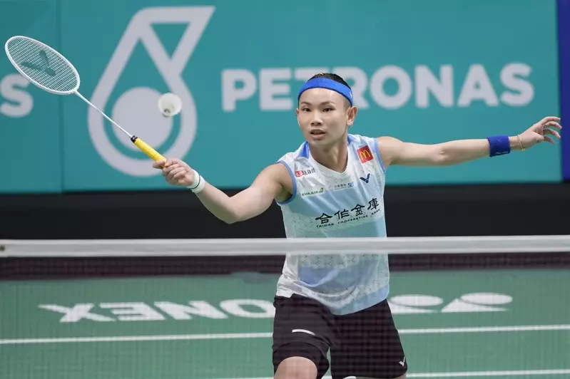

import Gears from "./Gears.astro"
import PullQuote from "@/components/PullQuote.astro"
import Bookmark from "@/components/Bookmark.astro"
import {Image} from "astro:assets"
import AnSeYoung from "./images/an-se-young.jpeg"
import Liyuxuan from "./images/liyuxuan.jpg"
import LiuHui from "./images/liuhui.jpeg"

今年是正儿八经打球的第一年。回顾了下：

- 一月第一次去了外面（小红书）找的局
- 一月第一次买了网课
- 三月在小红书上发了约球的笔记，第一次约到了单打
- 八月第一次请了陪练和教练

感谢所有陪我打球、帮助我进步的球友和教练。

## 网课和教练

### 李宇轩和刘辉

现在学打羽毛球网上资源已经非常丰富了。这两位是我看得最多的教练了。

李宇轩我买了除双打之外所有的网课。李宇轩的视频实在太多了，当然视频多也有多的道理：

首先，李宇轩的视频特别详细，细节特别多。羽毛球本身细节就很多，一个细节做不好了连环出错，问题在哪里很难找。很多重要的细节李宇轩又会重复好几次。
然而没有亲身体验重复再多遍还是记不住，只能大致有个印象，打着打着有点感觉了再重复看，加深理解，这样循环往复，螺旋上升。
还有就是李宇轩会各个角度拍，这个也非常有帮助。

刘辉也有网课，但是我没怎么看过，毕竟花了钱的都看不完，所以对刘辉的理解可能比较片面。

两人对比一下，李宇轩强调从完整开始动作开始学，先把动作做大、做夸张，等熟练以后动作再做小；刘辉是反过来，强调击球瞬间的感觉，然后再一步步加上前摇的动作，给这个击球的瞬间加成。
我觉得两种方式各有利弊，李宇轩的容易抓不住重点，刘辉的容易跑偏。

| **李宇轩：从大到小** | **刘辉：从小到大** |
| --- | --- |
| 从完整开始动作开始学，先把动作做大、做夸张，等熟练以后动作再做小 | 强调击球瞬间的感觉，然后再一步步加上前摇的动作，给这个击球的瞬间加成 |
| 容易抓不住重点 | 容易跑偏 |

最近还有鸭教练（是我鸭）我觉得讲得也挺不错。之前刷到过他的打球视频，感觉非常帅，进攻很犀利，还弄了个搞笑的英文名 It’s me duck，所以印象深刻。
最近鸭教练也开始搞直播教学了。他讲的球路多一些，我觉得是对李宇轩很好的补充。

### 几个看视频理解的偏差

在看了各大博主的内容之后，我感觉是对新手而言还得是李宇轩。不是说谁对谁错，大家说得都对，只是不同教练讲的侧重点略有不同，但很多强调的点可能听了个一知半解，容易误入歧途。

比如我踩过的坑就有这么几个：

**腿姐讲的挥拍内旋后拍面转 180 度。** 过度关注这个转拍面的效果，结果是非常容易提前抓紧导致切拍。
腿姐在评论里有说过，“击到球的时候是向前的，打完之后手臂惯性会让掌心朝外”。
这个评论更加关键。我观察我自己打球的视频，内旋非常多，感觉很容易做出来，注意力应该更多放在又没有转正拍面击球。
掌心朝外是挥拍挥得快以后自然会出现的现象，不用刻意去做。

<PullQuote emoji="🤔">
还有很多这种「矫枉过正」的动作。最经典的还有倒拍的时候贴着耳朵。这个动作应该是强调的顶肘。但太贴耳朵问题是有些不自然，可能会导致手臂提前发力。是否「矫枉过正」感觉因人而异，如果某个动作老是改不过来可以试一下。
</PullQuote>

**刘辉讲的拳式握法。** 同样容易导致提前抓紧切拍。李宇轩专门出过一期视频《害人的拳式握法》。
我的理解是拳式主要针对杀球时可以握紧球拍不至于脱手。但刚学杀球的时候主要矛盾应该不会是握不住球拍。
发力的时候握紧球拍是非常自然、下意识容易做出来的动作，但是放松不是，尤其是被动的时候下意识就会紧张，就会握紧球拍。
所以挥拍的时候“放松——抓紧”，放松这一段是难的，是要注意的地方。「拳式」和「半拳式」反而有点把问题复杂化了，
不如先忘了拳式握法，老老实实按照李宇轩说的食指在上的正常握法来。《害人的拳式握法》是我最近看过最有帮助的一期视频。

<Bookmark url="https://www.bilibili.com/video/BV17N411G7bh/" class="ring-1 ring-base-content/10 rounded p-3" />

**刘辉讲的安洗莹网前不跟（左）脚。** 我现在好像已经养成了上网不收左脚的习惯，感觉这样重心不会转到左脚上，基本靠右脚蹬回来，费劲又慢。
虽然这么说我感觉有的时候如果两脚迈得比较开，重心在中间，没有往前冲太多不怎么收左脚也不错。

今年安洗莹的成绩非常好，我有时也会看她的比赛。这里记录一下两位教练的总结：

<PullQuote class="pt-4 border-t-0">

  

    

      <Image src={AnSeYoung} alt="An Se Young" />
    

  

  <h2 class="text-base font-bold font-heading w-full pt-3 border-t border-base-content/10">安洗莹为啥那么强？</h2>

  

      

        <Image src={Liyuxuan} alt="李宇轩" />
      

  

  
李宇轩教练

  
左腿很有力！

  

      

        <Image src={LiuHui} alt="刘辉" />
      

  

  
刘辉教练

    
网前不跟脚、
  后场不转髋、
  头顶不侧身、
  挥拍不随摆

</PullQuote>

### 线下教练

我觉得看视频学动作和线下教练练球、纠正动作应该是效率最高的。如果教练可以及时指出问题的根源并针对性调整那更加事半功倍。

想练的太多，在场地上的时间实在有限，只能排下优先级。

## 两点打四点

最近我主要在练两点打四点（主练打后场两点，陪练打全场四点）。陈金管这个叫「九阳真经」，我觉得这个名字非常贴切。

这个难度很大，我现在还打不起来，几拍下来要么步伐乱套，要么回球不到位，马上陷入恶性循环。

现在的办法是每次都拍一下视频，然后回去一遍遍0.1倍慢速播放惨不忍睹的动作扣细节，再对照李宇轩的视频做调整。

我还找到了一段[示范视频](https://www.xiaohongshu.com/explore/642cd3680000000013008847)。希望2024年能打得像视频里那样。

## 挥拍

我觉得最重要的是找到鞭甩的感觉，达到摆正拍面击球的效果。

鞭甩的关键是身体、大臂、小臂、手腕、手指是一节一节往前推出去，最后食指往前推。最需要克服的是提前发力抓紧。在整个过程中，大部分时间应该是放松的，直到接近球了以后再发力。
在刚开始练的时候甚至可以整个动作都不要发力，否则容易动作变形。

<figure class="bento-wrapper">

<figcaption>戴资颖打球看上去鞭甩的效果非常明显，有着一种好像只捏着拍子末端一点点的感觉，更多地依赖拍头本身的重量。</figcaption>
</figure>

## 步法

### 启动

目前主要还是想通过两点打四点练平行启动。看练球视频现在启动的时机似乎好了一点。我理解卡在对面击球前双脚离地（但不是跳起来），击球后双脚踏地往下坐就对了。踏地往下坐的时间相对长一点，提供了一定的容错空间（大概几百毫秒）。

前后启动我觉得状况稍微好一点。可能是因为平时吊上网什么的练得相对多一些，还有就是本身前后启动就相对自然、简单一点。我感觉只要一直在走，不要站定不动就差不多能算有启动了。目前我觉得需要调整的是把这个启动做得再大一点。

### 退头顶

曾经有一阵子我一直纠结退头顶侧身太少，但现在感觉好像也不一定要侧得很多。

### 不要一直压低重心

之前总感觉打球的时候很紧张，不是很「放松」。我觉得一个原因可能是我起了球以后总是想着要立马压低重心，看上去就有点弯腰重心前倾。这样打球姿势会很丑陋。
最近我会注意不要什么时候的弯腰降低重心，接完下手球尽量站起来，找准时机启动。主动的时候更是尽量挺拔一点。

## 挑球

之前一直以为挑球就是从下面往上挑，但应该要让拍子在胸口附近的高度挑，这样才能挑得高。如果球比较低，需要借助弓箭步降低重心。
我还犯的一个错误是反手上网挑球的时候，等出右脚了再引拍。正确的是重心一挪到左脚就马上引拍到位，出右脚的同时伸拍接近球。这样一个节奏错误会导致击球点过低。
击球点低了就需要提前抓紧外旋，就会导致拍头往右边去，高度不够挑出界。

## 网前

现在网前没有什么技术，只会简单放个网。搓、勾感觉是风险高、容错低的技术，单打我觉得网前一般能推的推出去更加保险。当然这个也分阶段和打法，等水平再高一点我觉得也需要再加强一下网前。

另外，最近还想练一下带停顿放网和推。这个看上去似乎相对简单一点。

## 反手

今年早些时候练过一阵反手（高远球），经常犯的错误是跑错位置，比如跑过头球快到身后，或者跑得离球太近没有空间了。所以似乎要更多地往后转，而不是追着球跑，要和球有充分的距离。

不过后来也没怎么练反手了，感觉还是尽量做头顶，实在不行的打反手过渡。正好11月份李宇轩出了过渡视频，还是先过渡一下再说。

另外，我觉得现在需要加强一下打反手、抓反手这样的简单意识。有的时候觉得对面打了个没什么到位的反手，但是好像自己没有抓住机会。感觉可以安排一下这种球路的练习。

## 双打

我现在大概知道一些起球平行站，进攻前后站，谁放网谁顾网前这些规则，但打起来一直忘记，而且会缩手缩脚。水平太低的局基本打了个寂寞，运动量约等于零；水平太高的局感觉上去拖了大佬后腿；
水平差不多的局又经常因为配合问题或者队友莫名其妙的失误感觉憋屈。

总之双打对我来说是个套路更多、更复杂的游戏，还有更多人情的因素在里面，让我觉得心累。所以我现在非常不喜欢打双打。单打就更加纯粹，而且不管对面水平怎么样，都会有乐趣。

话虽这么说，我偶尔也有体会到双打的乐趣，主要就是球速更加快，能打起来的话确实非常刺激。

## 装备

<Gears />

我现在对研究装备没啥兴趣了，觉得还可以的就会一直用，懒得试别的了。

### 球拍

天斧100ZZ 4U：单打的时候用，有点费劲

雷霆90龙 3U：太重了，放家里练挥拍

战戟5000 4U：现在主力是它

### 球鞋

第一双买的是 `P9200`，但听信了“球鞋要买大一号”，真的就太大了，换了一次还是大，感觉包裹性不是很好。

后来买了 `65Z3` 国羽配色 `SHB65Z3CEX`。这双我觉得是见过颜值最高的球鞋了，总体感觉比 `P9200` 更好。

可惜穿了 3 个多月就左鞋就磨坏了。所以又买了黑色的 `65Z3`。这款经常在比赛直播看到。我记得最早是看到一场昆拉武特的比赛给这双鞋一个特写，然后我就记住了它。

<PullQuote emoji="👋">
球鞋现在也是耗材了，如果有谁左手持拍穿`40码65Z3`的话来<a href="mailto:i@yujinyan.me">联系我</a>吧。我们可以交换一下凑双新鞋。
</PullQuote>

