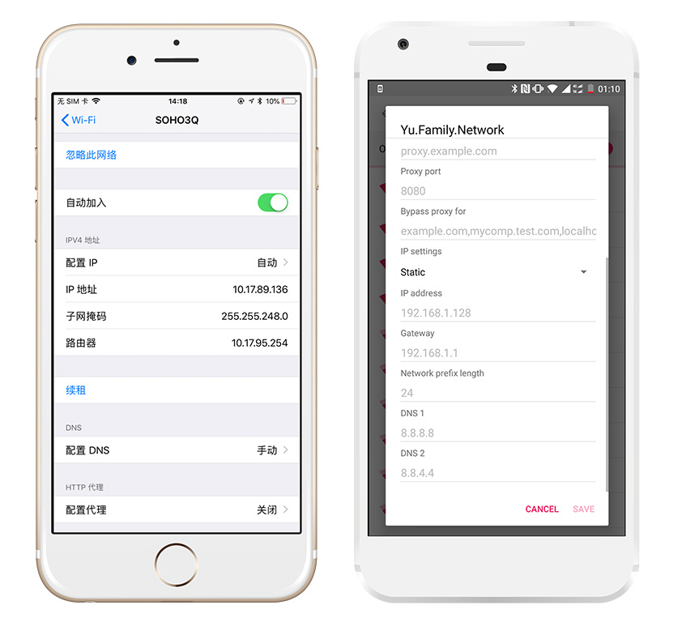
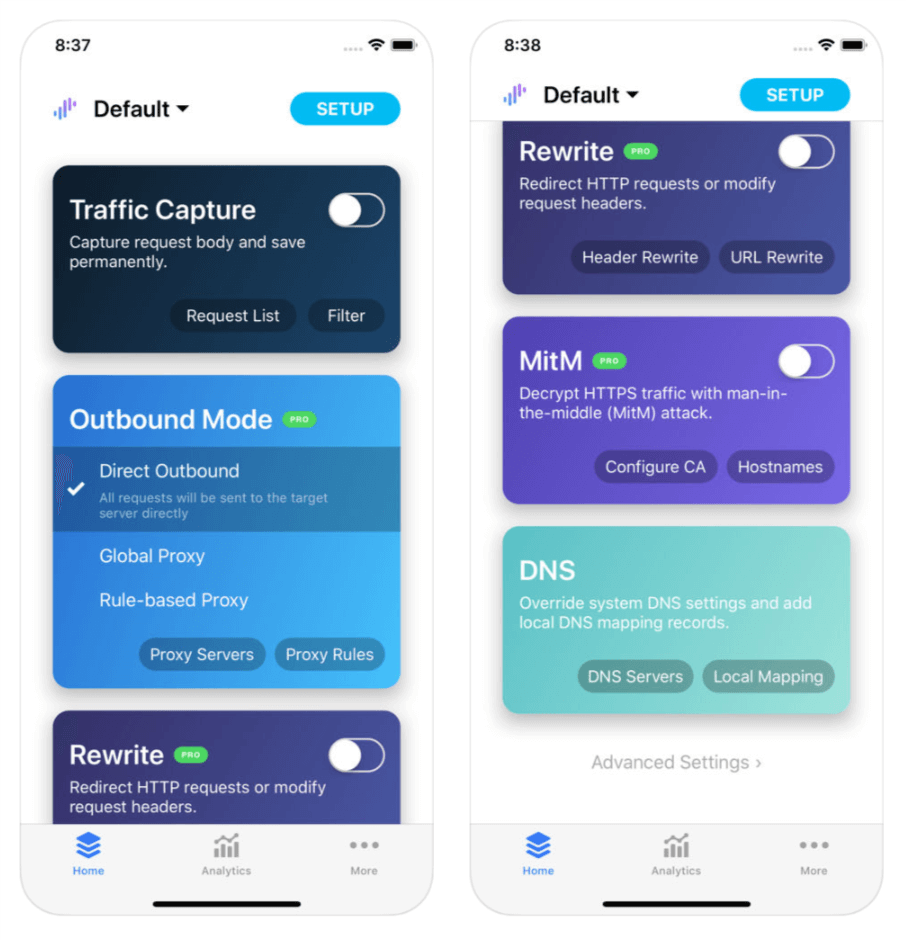

在客户端接口调试的过程中，有时会希望切换不同的环境进行测试。客户端如果更改请求地址需要重新编译比较麻烦，可以尝试修改域名解析，将请求转发到不同的服务器。这一思路在服务端或者客户端都可以实现。

## 服务端方案

[CoreDNS](https://github.com/coredns/coredns) 是一款 Go 编写的 DNS 服务器，可以轻松通过类似 Nginx 的配置文件实现一个加入自定义解析逻辑的 DNS 服务器。

### 下载安装

从 CoreDNS 的 [Release 页面](https://github.com/coredns/coredns/releases)下载编译好的二进制文件，并解压缩得到 coredns 可执行文件：

```shell
wget https://github.com/coredns/coredns/releases/download/v1.1.1/coredns_1.1.1_linux_amd64.tgz
tar xvzf coredns_1.1.1_linux_amd64.tgz
```

### 配置文件

在当前目录下新建 `Corefile` 配置文件（注意大写 C）。CoreDNS 借助一系列的插件（plugins）执行解析域名的操作，例如：

```
example.com {
    hosts hostfile
    log
}

. {
    forward . 8.8.8.8:53
    log
}
```

* 对 example.com 的解析应用 hosts 插件。hosts 插件将在当前目录下的`hostfile` 文件中查找域名对应的 IP 地址。hostfile 的格式类似操作系统的 host 文件；
* 如果域名不匹配 example.com，则默认将请求通过 forward 插件转发给 8.8.8.8 DNS 服务器；
* 对两条服务器块都应用 log 插件，将域名解析请求打印到标准输出设备，方便调试。

这样我们对于我们需要自定义解析的域名只需在 hostfile 中添加就行了:

```
# ./hostfile
1.1.1.1 example.com
```

### 运行

由于 DNS 服务默认监听 53 端口，需要 root 权限

```shell
sudo ./coredns
```

### 客户端配置



在 iOS 和 Android 的 Wi-Fi 设置中进入更多选项可以手动配置 DNS 服务器（Android 需要设置为固定 IP）。将前面搭建好的 DNS 服务公网地址填入即可。

## 客户端方案

在 PC 上我们可以通过 hosts 文件自定义域名解析规则。相比搭建自己的 DNS 服务，直接在设备上修改会更加便捷。



iOS 上推荐 Surge，可以直接添加自定义的域名解析规则。

<a
  href="https://itunes.apple.com/cn/app/surge-3-web-developer-tool/id1329879957?mt=8"
  style={{display: `inline-block`, overflow: `hidden`, background: `url(https://linkmaker.itunes.apple.com/assets/shared/badges/zh-cht/appstore-lrg.svg) no-repeat;width:135px;height:40px;background-size:contain;`}} />

## 参考资料

- https://coredns.io/2017/07/23/corefile-explained/
- https://coredns.io/plugins/hosts/

